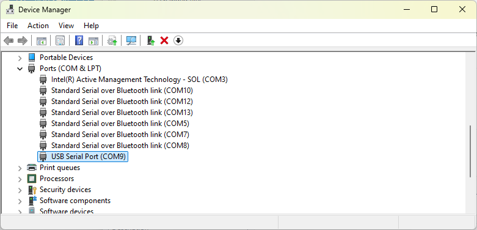
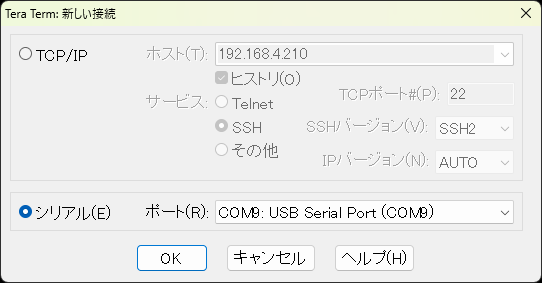
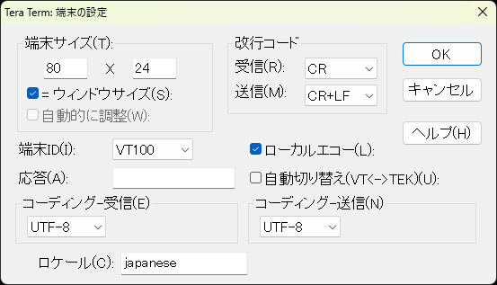
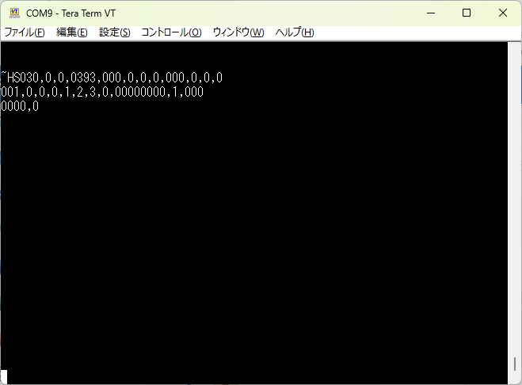

## ZebraプリンタとWindows PCをシリアル接続する方法

Zebra プリンタとホスト機器をシリアル接続するご要望は一定するある。

- PLC <> Printer
- PC <> Printer
- Iot Device <> Printer
- Scanner <> Printer

 

接続先のプリンタ機種によって、コネクタ形状が異なる。ホストとコネクタに合った接続ケーブルを用意すること。

| Printer | Connector Type   |
| ------- | ---------------- |
| ZT      | Dsub9(Female)    |
| ZD      | Dsub9(Female)*   |
| ZQ6     | Dsub9(特殊コネクタ） |
| ZQ6以外 | なし             |

\* Dsub9 I/Fがついている機種を選択すること。

 

参考までにWindows PCとZT/ZDプリンタをシリアル接続し、データを送受信する方法について記載する。

1. 準備するもの（推奨）

    - Windows 10以上のPC
    - ZT/ZDプリンタ (Dsub9ピンがあるもの)
    - USBシリアル変換ケーブル（[BSUSRC07シリーズ](https://www.buffalo.jp/product/detail/bsusrc0710bs.html)）
    - Dsub9 クロスケーブル オス-メス

     

1. USBシリアル変換ケーブルのドライバをインストールして、利用できるようにしておく。
     
    

1. Device Managerでポート番号を確認する。
    
     
    

1. TeraTermをインストールする。
    https://github.com/TeraTermProject/teraterm/releases
     
    

1. Teratermを起動する。
    シリアル > USBx: Serial Port (Comx)
    ※ 先に調べたComポート番号を選択する。

    
     
    

1. 設定＞端末

    - 送信 : CR+LF
    - ローカルエコー : チェック

    
     
    

1. OKを選択し、設定画面を閉じる。
     
    

1. ~HSを送信し、通信可否を確認する。

    

以上